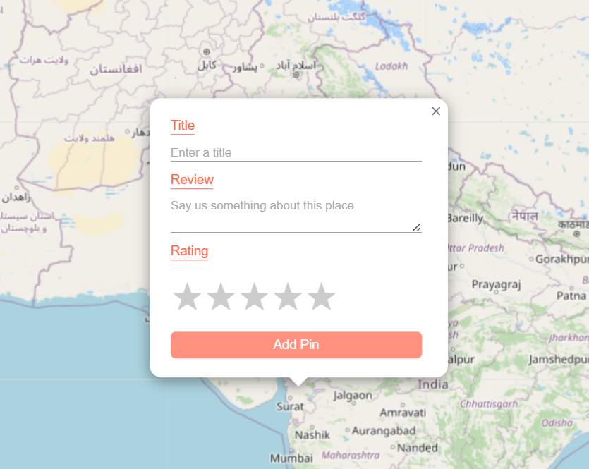

# Pin The Trip

This is a web app built with MERN Stack from scratch (MongoDB + Mongoose, Express, ReactJS & NodeJS).



This app can be accessed here: [https://pinthetrip.onrender.com](https://pinthetrip.onrender.com).

## Purpose

Helps to

- get basic understanding about MERN stack

## About The Project

In this application, you can pin your location and share your reviews with other users.

The users can pin their favourite locations on the map to which the users can rate them, write some descripion about that place which other users can see.

## Installation

If you wish to run this app locally, clone this repo and install the dependencies.

```
$ git clone https://github.com/RajKanani1206/pin-the-trip.git
$ cd pin-the-trip

(For Backend)
$ npm install
$ Update the .env variables (MongoDB URL, Email and more)
$ npm run server

(For Frontend)
$ cd client
$ npm install
$ npm start
```

## Contributing Guide

If you want to contribute, improve or fix bugs in this repo, then check out the [Contributing Guide](./CONTRIBUTING.md)

## License

This repository is MIT licensed. [Read more](./LICENSE)
